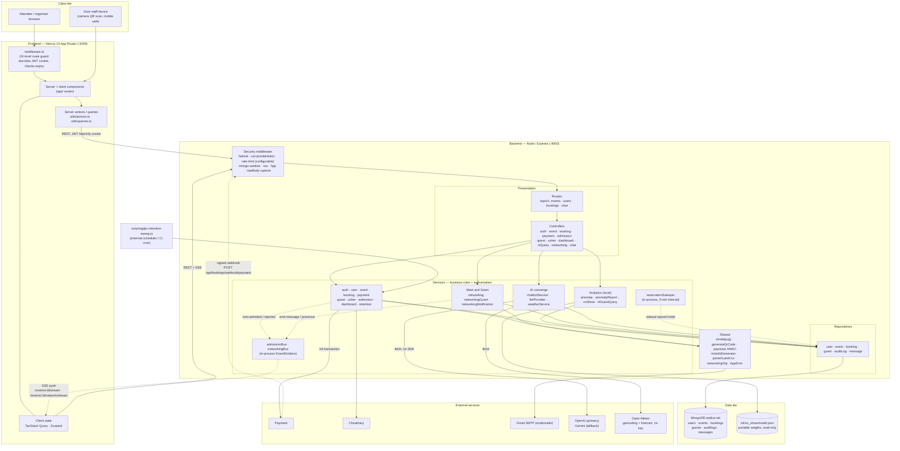
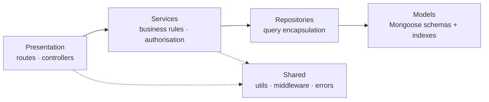
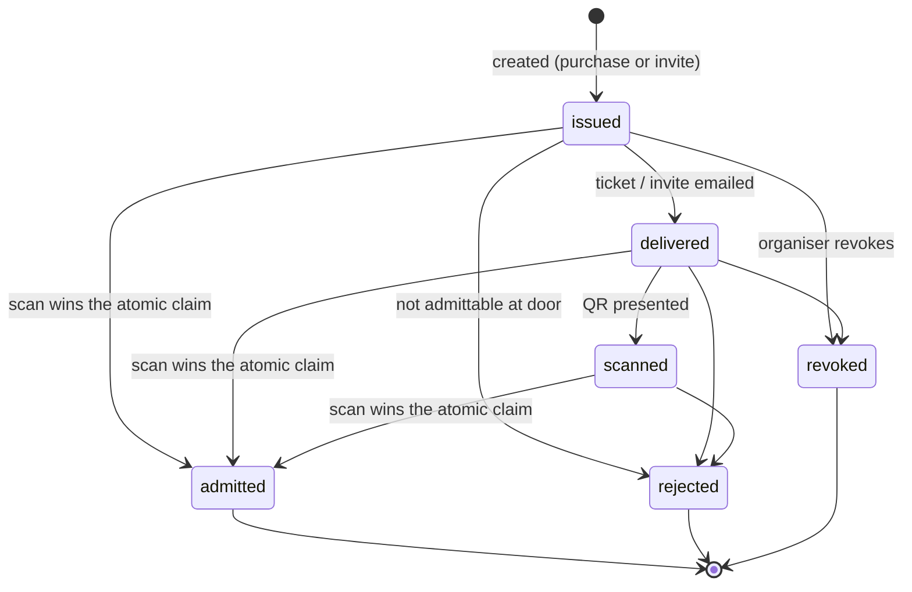
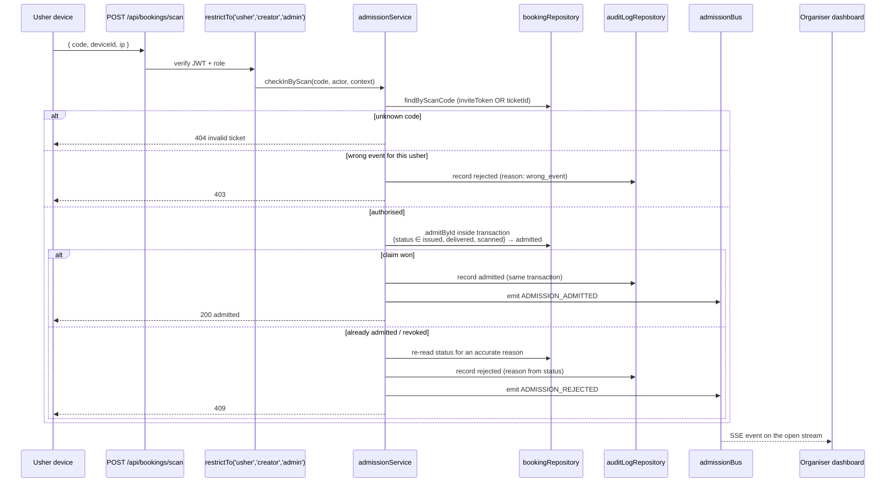
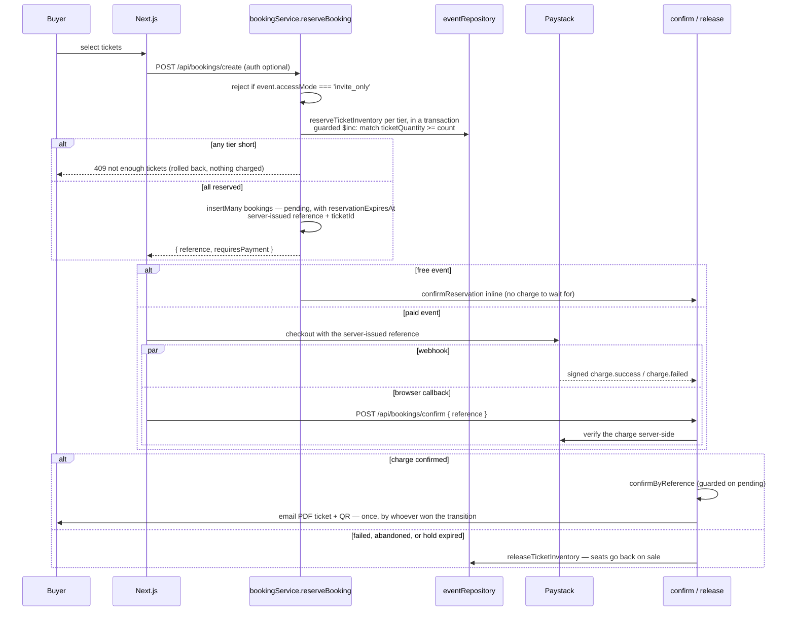
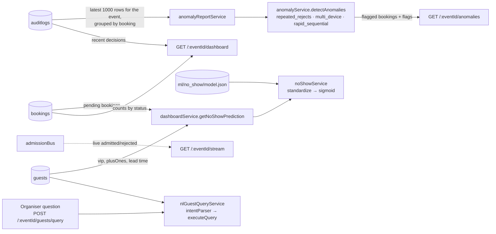

# TicketFlow — Architecture Diagram

> **Diagram set:** [Architecture](architecture-diagram.md) · [Use cases](use-case-diagram.md) · [Data flow](data-flow-diagram.md)
> All three describe the same system at different altitudes. Process numbers in the DFD
> (1.0–8.0) map to the service modules named here.

**Conventions.** Solid arrows are synchronous calls or request/response; dashed arrows are
asynchronous or inbound-from-outside (webhooks, server-sent events, in-process events).
Cylinders are persistent stores. Every claim below is traceable to a named module.

---

## 1. System / deployment architecture

**Note on the AI boundary.** Only the concierge chatbot (`BOT`) leaves the process for
inference. Everything else labelled AI here — anomaly detection, no-show prediction and
natural-language guest queries — runs locally: the first two on rule thresholds and a
portable weights file, and the NL guest query on a **regex intent parser, not a language
model**. The distinction matters both for the data-protection argument (guest lists are never
sent to a third party) and for accuracy in the report.

**Note on provider failure.** `llmProvider` calls OpenAI first and falls back to Gemini over
plain `fetch` with no vendor SDK, and with neither key configured the chatbot degrades to a
canned reply rather than erroring. An outage at either provider therefore removes a feature;
it never takes down a request path that sells or admits a ticket.

**Note on the frontend guard.** `middleware.ts` decodes the JWT client-side and treats any
unexpired token as authenticated — it does not verify the signature or read the role. It is a
redirect/UX convenience only. Every real authorisation decision is server-side
(`authController.protect`, `restrictTo`, and the ownership rules inside the services).

## 2. Layering and the dependency rule

Dependencies point one way. Controllers never touch models directly; services never touch
`req`/`res`. Authorisation lives in the service layer — `canViewDashboard` is reused by the
dashboard, the guest list, the NL query, and erasure, so the same ownership rule holds on
every route that reaches them.

## 3. Booking status state machine

The admission model is a six-state machine on `Booking.status`, not a boolean. `isCheckedIn`
is a derived virtual (`status === 'admitted'`), so there is one source of truth.

`bookingRepository.admitById` only matches `status ∈ {issued, delivered, scanned}` — that
guard *is* the single-use guarantee.

## 4. Door check-in — the integrity-critical path

Two simultaneous scans of one token both reach MongoDB; exactly one matches the status
guard, and the loser is written to `auditlogs` as a rejection with a reason. The audit write
shares the admission transaction, so an admitted booking can never lack its audit row. This
is why deployment requires a **replica set** — `withTransaction` throws on a standalone
`mongod`.

## 5. Purchase and payment

The flow is **reserve → pay → confirm**. Seats are held before the buyer reaches Paystack,
so a charge always has a booking behind it.

Three details that are easy to get wrong when reading this quickly:

- **Overselling is prevented by the guarded `$inc`, not by the transaction.**
  `reserveTicketInventory` matches `ticketQuantity: { $gte: count }` and decrements in one
  atomic operation; the transaction's job is all-or-nothing across *multiple tiers*.
- **Confirmation is idempotent and runs from two directions.** The webhook and the browser
  callback both land on `confirmReservation`; `confirmByReference` is guarded on
  `transactionStatus: 'pending'`, so exactly one call transitions the bookings and only that
  call sends email. Paystack's retries are therefore harmless.
- **The browser is never believed.** The callback supplies only a reference;
  `paymentService.confirmCheckout` verifies the charge against Paystack's API before
  confirming anything. It exists because a webhook can be delayed or misconfigured, and
  without it a paid reservation would be swept away 15 minutes later.

Every reservation has exactly one terminal outcome — confirmed, failed, or expired — and
each of them leaves inventory correct. `scripts/release-expired-reservations.js`
(`npm run reservations:release`) sweeps holds nobody resolved.

## 6. Analytics and live reporting

`anomalyService` is rule-based and pure — no training step, unit-testable, and evaluated
against a committed labelled fixture (`scripts/eval-anomaly.js`: precision 0.948, recall
0.821, F1 0.880). `noShowService` reimplements scikit-learn inference in JS from exported
weights, so the running app needs no Python; `tests/unit/noShow.test.js` is a parity test
against `predict_proba`.
