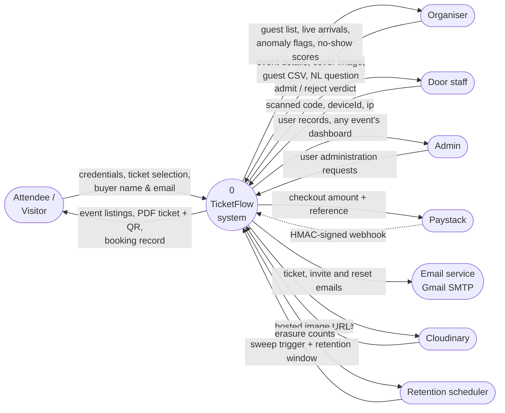
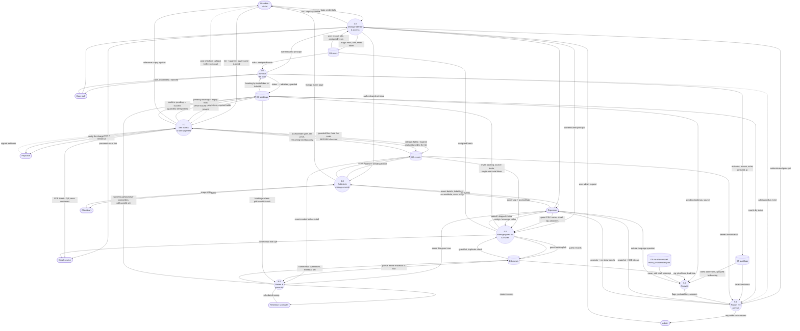
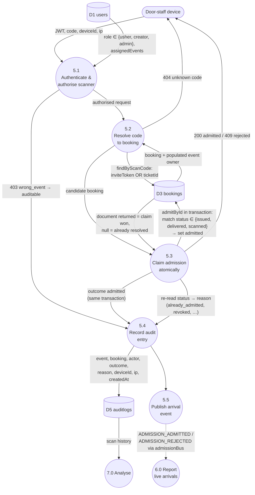

# TicketFlow — Data Flow Diagram (DFD)

> **Diagram set:** [Architecture](architecture-diagram.md) · [Use cases](use-case-diagram.md) · [Data flow](data-flow-diagram.md)

Levelled, Gane–Sarson style. External entities are stadium-shaped, processes are circles,
data stores are cylinders. Process numbers are stable across levels and are referenced from
the other two documents.

| Process | Implemented by |
|---|---|
| 1.0 Manage identity & access | `authService`, `userService` |
| 2.0 Publish & manage events | `eventService` |
| 3.0 Sell tickets & take payment | `bookingService`, `paymentService` |
| 4.0 Manage guest list & invites | `guestService`, `usherService` |
| 5.0 Admit at the door | `admissionService` |
| 6.0 Report live arrivals | `dashboardService`, `admissionBus` |
| 7.0 Analyse | `anomalyReportService`, `anomalyService`, `noShowService`, `nlGuestQueryService` |
| 8.0 Retain & erase PII | `retentionService` |

---

## Level 0 — Context diagram

---

## Level 1 — Processes and data stores

---

## Level 2 — Process 5.0, Admit at the door

**Why 5.3 is the whole design.** The single-use guarantee is a conditional single-document
update, not a read-then-write: concurrent scans of one code both reach MongoDB, exactly one
matches the status guard, and the loser is recorded in D5 as a rejection with an accurate
reason. The audit write for a successful admission shares the admission transaction, so an
admitted booking cannot exist without its audit row. Both facts depend on a replica set —
`withTransaction` throws on a standalone `mongod`.

---

## Data store reference

| Store | Collection | Key elements | Written by | Read by |
|---|---|---|---|---|
| D1 | `users` | name, email, password hash, role, `assignedEvents`, reset token | 1.0, 4.0 | 1.0, 4.0, 5.0 |
| D2 | `events` | eventName, slug, start/endDate, location, `ticketDetails[]`, `accessMode`, creator, coverImage, numberOfAttendees | 2.0, 3.0 | 2.0, 3.0, 4.0, 6.0, 8.0 |
| D3 | `bookings` | event, user, name, email, price, ticketId, `inviteToken` (select:false), `source`, `status`, `transactionStatus`, reference, `piiErasedAt` | 3.0, 4.0, 5.0, 8.0 | 3.0, 5.0, 6.0, 7.0, 8.0 |
| D4 | `guests` | event, name, email, vip, plusOnes, booking, `erasedAt` | 4.0, 8.0 | 4.0, 7.0, 8.0 |
| D5 | `auditlogs` | event, booking, actor, outcome, reason, deviceId, ip, createdAt | 5.0 | 6.0, 7.0 |
| D6 | `ml/no_show/model.json` | mean, std, coef, intercept | offline (`ml/no_show/train.py`) | 7.0 |

## Notes on flows carrying personal data

- **D3 and D4 are the PII stores.** Every booking carries a name and email regardless of
  `source`, which is why `piiErasedAt` lives on Booking rather than being reached only
  through Guest — a purchase booking has no Guest record at all.
- **Erasure anonymises in place.** 8.0 overwrites `name` to `'Erased Guest'` and `email` to a
  per-document-unique `erased-<id>@erased.invalid`, then stamps the flag. `vip`, `plusOnes`,
  `price`, `ticketType`, `source` and `status` survive, so arrival statistics in 6.0 and the
  no-show features in 7.0 remain usable after erasure.
- **The unique placeholder is required, not cosmetic.** `guests` has a unique `(event, email)`
  index; erasing several guests on one event to a shared address would collide.
- **The sweep is idempotent.** `findUnerasedByEvents` filters on `erasedAt: null` /
  `piiErasedAt: null`, and both collections carry a compound index on `(event, <flag>)` for
  exactly that query, so it is safe to run on a repeating schedule.
- **D5 retains device fingerprints and IPs and is never swept.** It references bookings by
  id, so erasure never has to rewrite audit history — but note this means IP and deviceId
  outlive the erasure of the names they were collected alongside.
- **Both erasure entry points converge on `eraseGuest`.** The manual path adds a
  `canViewDashboard` check, the same owner/admin rule as 6.0.
- **Passwords never leave 1.0.** Only the bcrypt hash enters D1, and the JWT returned to the
  actor carries no credential material.
