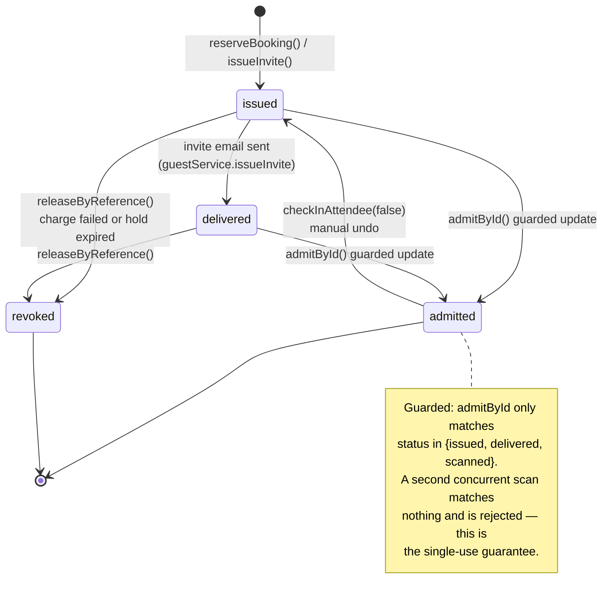
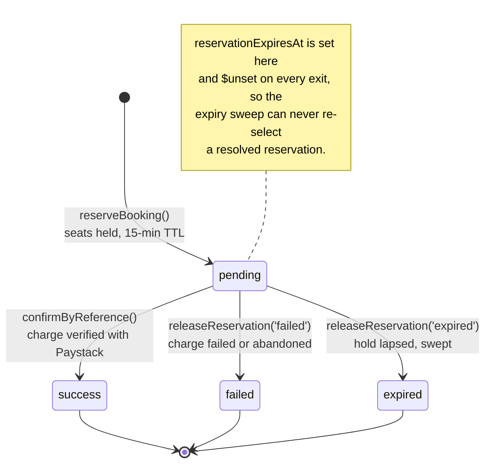
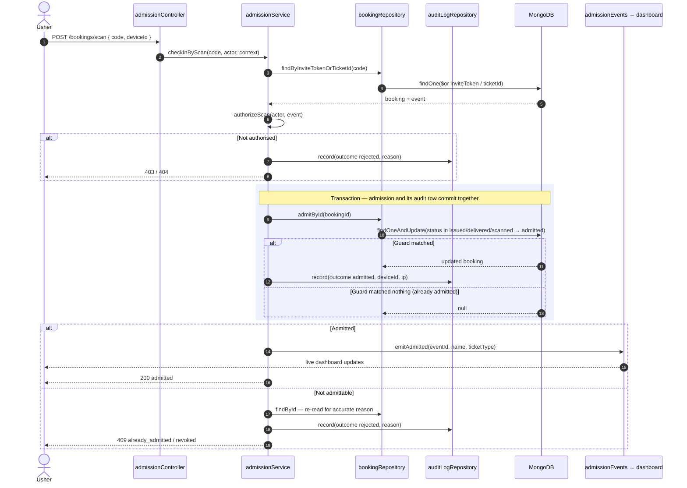
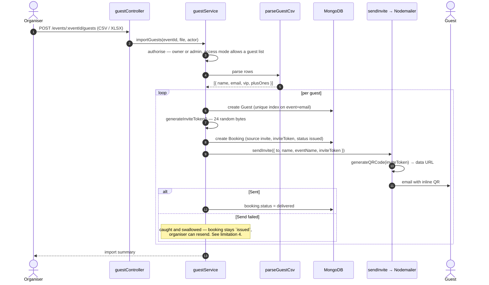
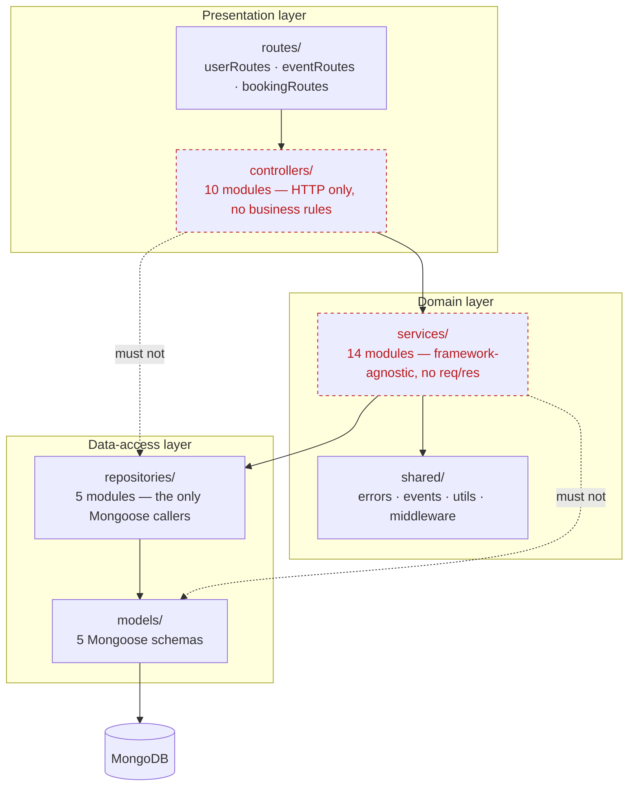
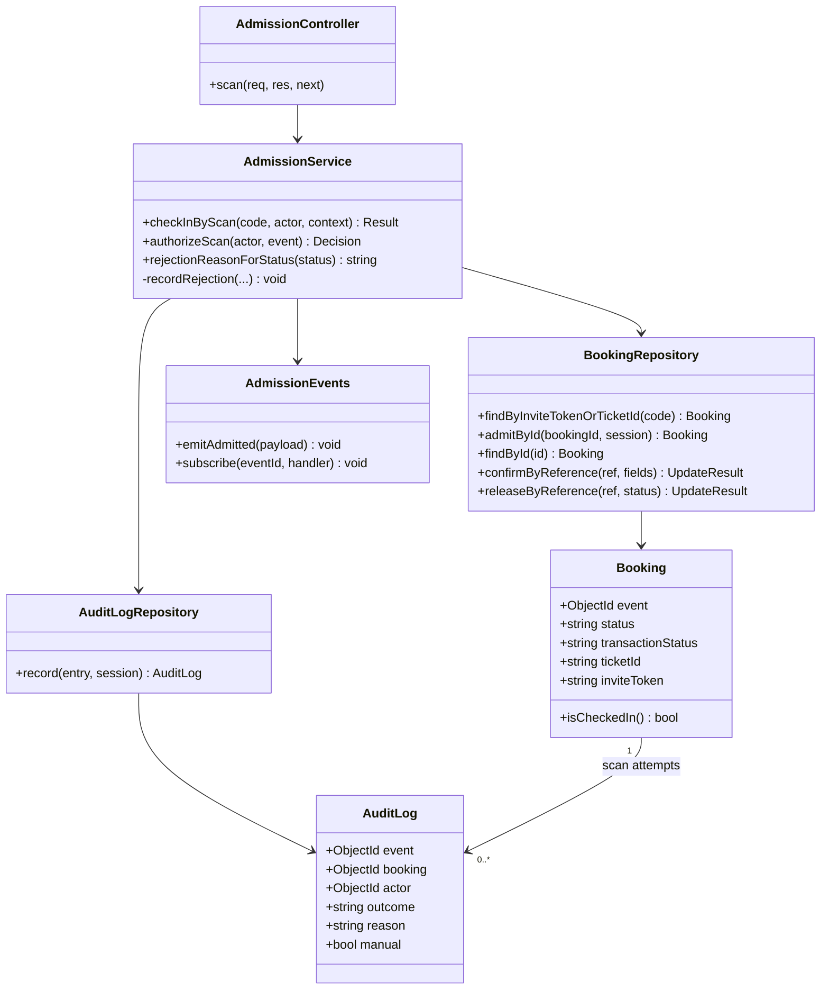

# TicketFlow — Design Models

**Document version:** 1.0 · **Verified against:** branch `dev`, 5 August 2026

> Companion to [`technical-documentation.md`](technical-documentation.md), which carries the architecture overview and entity-relationship model. This document adds the **behavioural and structural** models — state machines, interaction sequences and package structure — so the design evidence spans several modelling techniques rather than one family.
>
> Every model here was derived by reading the implementation, not from an idealised design. Where the code and a textbook model would differ, the code is shown and the discrepancy is called out.

## Modelling techniques used across the documentation set

| Technique | Category | Document |
|---|---|---|
| Use-case diagram | Functional / requirements | `use-case-diagram.md` |
| Data-flow diagram | Functional / process | `data-flow-diagram.md` |
| Architecture / deployment diagram | Structural | `architecture-diagram.md`, `technical-documentation.md` §3 |
| Entity-relationship diagram | Data | `technical-documentation.md` §4 |
| **State machine diagram** | **Behavioural** | **§1 below** |
| **Sequence diagram** | **Behavioural / interaction** | **§2–3 below** |
| **Package & class diagram** | **Structural** | **§4–5 below** |

---

## 1. Booking state machines

A booking carries **two independent status axes**. Collapsing them into one field would make legitimate states unrepresentable — a ticket can be paid but not yet admitted, and a free-event ticket is admitted having never been charged.

### 1.1 Admission lifecycle — `Booking.status`

**Guard condition.** The transition to `admitted` is a conditional atomic update (`bookingRepository.admitById`) that matches only `status ∈ {issued, delivered, scanned}`. Two concurrent scans therefore produce exactly one match; the loser re-reads the booking, maps the current status to a rejection reason via `rejectionReasonForStatus`, writes a rejection audit row and returns HTTP 409. This is the behaviour proved by `tests/integration/admission.scan.test.js`.

**Rejections are not a booking state.** A refused scan is recorded on `AuditLog` (`outcome: 'rejected'`), never on the booking. The booking keeps whatever status it already held, which is what allows a guest rejected once — say, arriving at the wrong event — to be admitted later at the right one.

> **Finding: two enum values are unreachable.** `Booking.status` declares `scanned` and `rejected`, but no code path assigns either. `scanned` is accepted by the admittable guard (so a booking in that state *could* be admitted) but nothing ever writes it, and `rejected` is superseded by the audit-log design described above. Recorded in `technical-documentation.md` §12 as a cleanup item — either implement a scanned-but-not-yet-admitted step or remove the values, since a declared-but-unreachable state is a maintenance trap.

### 1.2 Payment lifecycle — `Booking.transactionStatus`

Both exits from `pending` are **guarded on `pending` itself** (`updateMany({ reference, transactionStatus: 'pending' }, …)`). Whichever caller obtains `modifiedCount > 0` owns the follow-up side effect — sending tickets, or returning seats to inventory. This is what makes the flow safe against Paystack's webhook retries racing the client's confirm call, and against the expiry sweep racing a late confirmation. Covered by `tests/integration/reservation.lifecycle.test.js`.

### 1.3 Combined state validity

| `transactionStatus` | `status` | Meaning | Reachable |
|---|---|---|---|
| `pending` | `issued` | Seats held, awaiting payment | ✓ |
| `success` | `issued` / `delivered` | Paid, ticket issued, not yet arrived | ✓ |
| `success` | `admitted` | Paid and at the venue | ✓ |
| `failed` / `expired` | `revoked` | Abandoned checkout, seats returned | ✓ |
| `pending` | `admitted` | Admitted without paying | ✗ — free events are confirmed inline before tickets exist |

---

## 2. Sequence — atomic door admission

The critical path of the system: it must admit exactly once under concurrency, and must never log an admission that did not happen.

**Why the audit write is inside the transaction.** If the admission committed but the audit row failed, the log would under-report admissions; if the reverse, it would show admissions that never happened. Since the log is the input to both the live dashboard and anomaly detection, either inconsistency corrupts downstream features. Binding them in one transaction is why MongoDB must run as a replica set.

**Why the reason is re-read rather than inferred.** When the guard matches nothing, the service does not assume "already admitted" — it re-reads the booking and maps the actual current status, so a revoked ticket is reported as revoked rather than mislabelled.

---

## 3. Sequence — guest invite issuance

**Deliberate design points.** The guest and its booking are persisted *before* the email is attempted, so a mail outage cannot lose the guest list. The unique compound index on `{event, email}` makes re-importing the same file idempotent at the guest level rather than issuing duplicate invites.

**Known weakness shown honestly.** The `catch` around delivery is empty — a misconfigured mailer produces no log line and no user-visible signal, only guests silently stuck at `issued`. This is limitation 4 in `technical-documentation.md` §12.

---

## 4. Package diagram — layered dependencies

**The rule this encodes.** Each layer may call only the one beneath it. No controller imports a repository; no service imports a Mongoose model. The two dashed edges are the violations the structure exists to prevent.

**Why it matters beyond tidiness.** Because services take no `req`/`res` and touch no Mongoose types, the authorisation rules are ordinary pure functions — which is exactly why `admissionService.authorizeScan` and `dashboardService.canViewDashboard` can be unit-tested with no HTTP layer and no database (`tests/unit/admission.authz.test.js`, `tests/unit/dashboard.authz.test.js`). The layering is what buys the test strategy.

---

## 5. Class diagram — admission subsystem

The subsystem carrying the single-use guarantee, modelled structurally.

`authorizeScan` and `rejectionReasonForStatus` are exported separately from `checkInByScan` specifically so the decision logic can be exercised without a database — the structural choice that makes the authorisation matrix in §7.2 of the technical documentation directly testable.

---

*Derived from branch `dev` on 5 August 2026. Diagrams render natively in GitHub, VS Code and the published artifact; export as PNG/SVG via the Mermaid Live Editor for pasting into the Word submission.*
