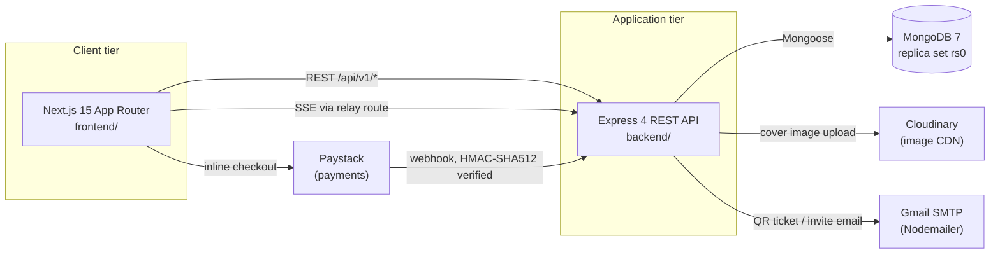
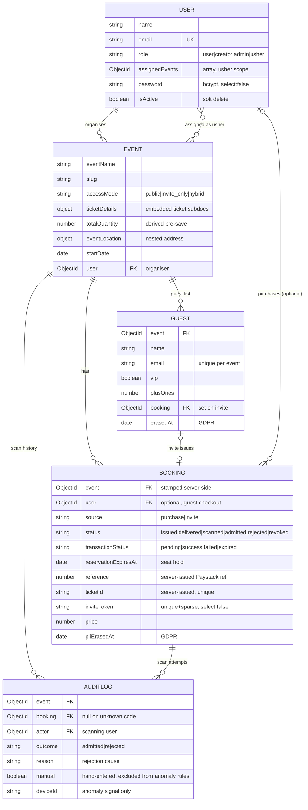
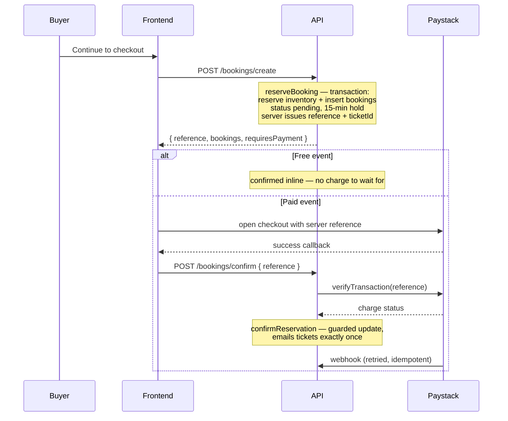

# TicketFlow — Technical Documentation

**Document version:** 3.0 · **Repository state:** branch `dev`, working tree ahead of commit `5673881` · **Last verified:** 5 August 2026

> **Changes since v2.0.** The checkout flow was restructured from *create-then-pay* to **reserve → pay → confirm** (§5.2); ticket IDs are now **server-issued and unique** rather than minted in the browser (§5.3); QR codes are now generated for purchased tickets, not only invites (§5.4). Limitation 1 from the previous revision (client-generated ticket IDs) is closed and removed from §12; the remaining items still stand.

> **Purpose.** This document is supporting technical evidence for **7003SCN Advanced Software Development, Task 1.2** (design, implementation and testing evidence). Every claim below was verified by reading the source at the cited path — file paths are given so that screenshots for the Word submission can be taken directly from the repository and annotated.
>
> **Scope boundary.** This document covers only what is derivable from the codebase. Task 1.1 (agile process evidence, team member contributions), Tasks 2.1/2.2 (individual leadership and entrepreneurship evaluations) and Task 3 (peer assessment) require your team's own process artefacts and personal critical reflection, and are deliberately **not** covered here. See §13 for the coverage map.

---

## Contents

1. [Product overview](#1-product-overview)
2. [Technology stack](#2-technology-stack)
3. [Architecture](#3-architecture)
4. [Data model](#4-data-model)
5. [Feature implementation map](#5-feature-implementation-map)
6. [API reference](#6-api-reference)
7. [Authentication and security](#7-authentication-and-security)
8. [Testing strategy](#8-testing-strategy)
9. [Build, CI and deployment](#9-build-ci-and-deployment)
10. [User interface and design system](#10-user-interface-and-design-system)
11. [Development history as iterative-delivery evidence](#11-development-history-as-iterative-delivery-evidence)
12. [Known limitations and recommended improvements](#12-known-limitations-and-recommended-improvements)
13. [Mapping to assignment marking criteria](#13-mapping-to-assignment-marking-criteria)

---

## 1. Product overview

**TicketFlow** is a full-stack event-ticketing platform extended with an invite-only and hybrid guest-management module ("EntryPoint"). A single data model serves three distinct real-world scenarios:

| Scenario | Access mode | How guests are admitted |
|---|---|---|
| Public ticketed event | `public` | Anyone browses and buys a ticket (Paystack); QR issued on purchase |
| Invite-only event | `invite_only` | Organiser uploads a guest list; each guest receives a single-use QR invite; purchase is refused |
| Hybrid event | `hybrid` | Both paid tickets and a curated guest list coexist on one event |

Beyond the core sell-and-admit loop, the system adds a door scanner with an atomicity guarantee, a real-time arrivals dashboard, and three lightweight AI/ML features (scan-anomaly detection, natural-language guest queries, no-show prediction).

### 1.1 User roles

Defined by the `role` enum in `backend/src/models/userModel.js` and enforced by `authController.restrictTo`:

| Role | Persona | Key capabilities |
|---|---|---|
| `user` *(default)* | Attendee | Browse events, purchase tickets, view "My Tickets" |
| `creator` | Event organiser | Create/edit own events, manage guest list, assign ushers, view live dashboard |
| `usher` | Door staff | Scan and admit — **scoped to events listed in `User.assignedEvents` only** |
| `admin` | Platform administrator | Unrestricted access to all events and users |

---

## 2. Technology stack

Versions are taken from `backend/package.json` and `frontend/package.json`.

### 2.1 Frontend

| Concern | Choice |
|---|---|
| Framework | Next.js `^15.3` (App Router), React `^18.3`, TypeScript `^5` |
| Styling | Tailwind CSS `^4` with custom `@theme` tokens; Ant Design `^6.5`; `react-select` |
| Server state | TanStack Query `^5.101`; Axios `^1.19` as HTTP client |
| Client auth | `jwt-decode` + `cookies-next`, gated in Next.js Edge middleware |
| Payments | `react-paystack` `^4.0` |
| QR / export | `react-qr-code`, `react-barcode`, `react-to-pdf`, `html-to-image` |
| Guest import | `xlsx` (CSV and `.xlsx` parsing) |
| Testing | Vitest `^2.1` + React Testing Library (component); Playwright `^1.62` (end-to-end) |

### 2.2 Backend

| Concern | Choice |
|---|---|
| Runtime | Node.js `>=20` (`engines`), ES Modules; CI runs Node 22 |
| Framework | Express `^4.22` |
| Database | MongoDB 7 via Mongoose `^8.24` — **must run as a replica set** (see §3.5) |
| Authentication | `jsonwebtoken` `^9` + `bcrypt` `^6`, HTTP-only cookies |
| Hardening | `helmet`, `express-mongo-sanitize`, `express-xss-sanitizer`, `hpp`, `express-rate-limit`, `cors` |
| Payments | Paystack — **no SDK**; webhook verified by hand-rolled HMAC-SHA512 (`shared/utils/paystack.js`) |
| Media | Cloudinary `^2.10` (event cover images) |
| Email | Nodemailer `^9`; **Pug** templates for account email, **inline HTML strings** for ticket/invite email (see §5.4) |
| QR generation | `qrcode` `^1.5` (server-side, emitted as base64 data URLs) |
| ML | Logistic model trained offline in Python; coefficients loaded from `ml/no_show/model.json` |
| Testing | Node's built-in runner (`node --test`) — no third-party test framework |

> **Correction note (v2.0):** earlier drafts described email templating as "Nodemailer + Pug" without qualification. In fact only account emails (`welcome`, `passwordReset`) use Pug via `shared/utils/email.js`; the digital ticket (`shared/utils/document.js`) and guest invite (`shared/utils/sendInvite.js`) are built as inline HTML template literals.

---

## 3. Architecture

### 3.1 System context

Two independently deployable applications share one MongoDB database, orchestrated by `docker-compose.yml`:



### 3.2 Backend layering

The backend implements a **Controller → Service → Repository → Model** separation. Controllers hold no business logic; services are framework-agnostic (no `req`/`res`), which is what makes the pure-function authorisation tests in §8 possible.

```
backend/
├── app.js                      # Express wiring: middleware chain, routers, error handler
├── server.js                   # Process entrypoint, DB connection
├── src/
│   ├── models/                 # 5 Mongoose schemas
│   ├── presentation/
│   │   ├── controllers/        # 10 thin HTTP handlers
│   │   └── routes/             # 3 Express routers (user, event, booking)
│   ├── services/               # 14 service modules + nlQuery/ submodule
│   ├── repositories/           # 5 data-access modules wrapping Mongoose
│   └── shared/
│       ├── errors/             # AppError + global error handler
│       ├── events/             # admissionEvents.js — in-process pub/sub for SSE
│       ├── middleware/         # catchAsync, uploadImage
│       └── utils/              # email, QR, HTML ticket, Paystack HMAC, invite tokens
├── ml/no_show/                 # train.py, model.json, eval_report.txt
├── scripts/                    # migrations, GDPR sweep, ML/NL evaluation harnesses
└── tests/{unit,integration,fixtures,helpers}/
```

**Layer boundary example.** `bookingController.createBooking` performs only request unpacking and delegates to `bookingService.createBooking`, which orchestrates `eventRepository.reserveTicketInventory` and `bookingRepository.insertMany` inside a transaction. No Mongoose model is imported above the repository layer.

### 3.3 Real-time updates

The live arrivals dashboard uses **Server-Sent Events**, not polling or WebSockets. `GET /api/v1/events/:eventId/stream` (`dashboardController.streamEvent`) subscribes to an in-process `EventEmitter` in `shared/events/admissionEvents.js`, which `admissionService` publishes to on every successful admission. The frontend consumes this through a Next.js Route Handler relay at `frontend/src/app/api/events/[eventId]/stream/route.ts`.

*Design rationale:* admissions are a one-way server→client push with modest fan-out (door staff plus one organiser), so SSE delivers the requirement over plain HTTP without introducing a WebSocket server or an external broker such as Redis.

### 3.4 Frontend structure

App Router route groups organise pages by domain without affecting URLs:

```
frontend/src/app/
├── (authentication)/   login · signup · forgot-password · reset-password
├── (events)/           create-event · edit-event · dashboard · event-team ·
│                       explore-events · guest-list · my-events · scan
├── (legal)/            data-and-privacy · refund-policy · terms-and-conditions
├── (overview)/         landing page (page.tsx + loading.tsx)
├── my-profile/         tickets · event-history · event-sales · settings · help-and-support
├── checkout/ · about-us/ · contact-us/
└── api/events/[eventId]/stream/route.ts    # SSE relay
```

**Two-layer route protection.** `frontend/src/middleware.ts` decodes the JWT cookie at the edge and redirects unauthenticated users away from `protectedRoutes`, and authenticated users away from login pages. This decodes but does **not** verify the signature — it is a user-experience convenience only. The authoritative security boundary is server-side `protect` / `restrictTo` in Express (§7).

### 3.5 Why a replica set is mandatory

Ticket reservation (`eventRepository.reserveTicketInventory`) and door admission (`admissionService.checkInByScan`) use **multi-document transactions**, which MongoDB only supports on a replica set — a standalone `mongod` throws at `startSession().withTransaction()`. Both `docker-compose.yml` and the CI workflow therefore initialise a single-node replica set (`rs0`) rather than a plain instance. Integration tests detect the absence of a replica set and skip gracefully (`tests/helpers/db.js`).

---

## 4. Data model

Five collections. The central modelling decision is to unify ticketed and invite-only events under **one** `Event` type discriminated by `accessMode`, rather than maintaining two parallel event systems.



### 4.1 Design decisions worth citing as evidence

| Decision | Implementation | Rationale |
|---|---|---|
| **`accessMode` unification** | `Event.accessMode` enum; sales-date fields use *function-valued* `required` validators so they apply only when `accessMode !== 'invite_only'` | One schema serves three business scenarios; avoids duplicating the entire event/booking surface |
| **`Booking.status` state machine** | `issued → delivered → scanned → admitted`, with `rejected`/`revoked` as terminal states; a virtual `isCheckedIn` preserves the old boolean contract | Replaced a boolean `isCheckedIn` flag; enables richer reporting and makes double-admission detectable |
| **Conditional purchase fields** | `requiredForPurchase` validator array (`bookingModel.js:6–11`) gates `currency`, `ticketId`, `reference` etc. on `source === 'purchase'` | Invite bookings have no checkout, so payment fields must not be mandatory |
| **`Guest` as its own collection** | Not embedded in `Event`; unique compound index `{event, email}` | Guest lists can be large; embedding would bloat the event document and prevent per-guest indexing |
| **`AuditLog` append-only** | One document per scan attempt, success *or* rejection; `manual: true` marks hand-entered admissions | A status flag records only the final state; the log preserves every attempt. Manual entries are excluded from anomaly detection — they carry no device fingerprint or scan timing, so including them would manufacture false `rapid_sequential` flags |
| **Two independent status axes** | `status` tracks *admission* (`issued…admitted`); `transactionStatus` tracks *payment* (`pending…success`) | A ticket can be paid but not yet admitted, or admitted on a free event that was never charged. Collapsing both into one field would make those states unrepresentable |
| **Server-issued identifiers** | `reference`, `ticketId` and `event` are all stamped in `reserveBooking` **after** the client payload is spread, so a supplied value is discarded | `ticketId` is the code the door scanner admits on, and `reference` binds a charge to a reservation. Accepting either from the client lets a caller choose its own admission code or attach to someone else's charge |

---

## 5. Feature implementation map

### 5.1 Feature-to-source index

| Feature | Primary source |
|---|---|
| Signup / login / logout / password reset | `presentation/controllers/authController.js`, `services/authService.js` |
| Profile update, soft-delete account | `userController.js`, `services/userService.js` |
| Event discovery (list, count, trending, upcoming, detail) | `eventRoutes.js:13–17`, `services/eventService.js` |
| Event creation & editing with image upload | `eventController.js`, `shared/middleware/uploadImage.js` (Cloudinary) |
| Seat reservation & checkout | `bookingService.reserveBooking`, `frontend/src/hooks/usePaystack.tsx` |
| Payment confirmation (server-authoritative) | `bookingService.confirmReservation`, `paymentService.confirmCheckout`, `shared/utils/paystack.js` |
| Reservation release & expiry sweep | `bookingService.releaseReservation`, `releaseExpiredReservations`, `scripts/release-expired-reservations.js` |
| **Ticket ID issuance** | `shared/utils/ticketIdGenerator.js` (server-side, crypto-random, unique-indexed) |
| **QR ticket generation & email** | `shared/utils/generateQrCode.js`, `shared/utils/document.js`, `shared/utils/generatePdf.js` |
| Guest-list import (CSV / XLSX) | `guestController.importGuests`, `shared/utils/parseGuestCsv.js` |
| Invite issuance (single-use QR) | `shared/utils/inviteToken.js`, `shared/utils/sendInvite.js`, `services/guestService.js` |
| **Atomic door scan-and-admit** | `services/admissionService.js` — `checkInByScan`, `authorizeScan` |
| Usher assignment | `usherController.js`, `services/usherService.js` |
| Live arrivals dashboard (SSE) | `dashboardController.js`, `services/dashboardService.js` |
| Scan anomaly detection | `services/anomalyService.js`, `services/anomalyReportService.js` |
| Natural-language guest queries | `services/nlQuery/intentParser.js`, `services/nlQuery/executeQuery.js` |
| No-show prediction | `ml/no_show/train.py` (offline), `services/noShowService.js` (runtime) |
| GDPR erasure & retention sweep | `services/retentionService.js`, `scripts/gdpr-retention-sweep.js` |

### 5.2 Checkout lifecycle — reserve, pay, confirm

Checkout is a three-phase flow. The ordering is the design point: seats are held **before** the buyer reaches Paystack, so a charge can never exist without a booking behind it.



**Why it was restructured.** The earlier flow charged the buyer first and only then asked the API to create the booking. A closed tab, a dropped connection, or a tier selling out between payment and callback left a buyer charged with no ticket; and because inventory was decremented only after payment, two buyers could both pay for the last seat.

**Failure handling.** An abandoned or failed charge is released by `releaseReservation`, and any hold older than `RESERVATION_TTL_MS` (15 minutes) is swept by `releaseExpiredReservations` (`npm run reservations:release`). Both are guarded on the `pending` state, so a webhook retry racing the sweep cannot credit the same seats twice. Released bookings are marked `revoked` rather than deleted, keeping abandoned checkouts auditable.

**Idempotency.** Both the client's confirm call and Paystack's (retried) webhook land in `confirmReservation`. A guarded update means exactly one call transitions the bookings and sends email; the rest are no-ops that still report success.

### 5.3 Ticket ID issuance

`ticketId` is not merely a display reference — `bookingRepository.findByInviteTokenOrTicketId` resolves a scanned QR against `inviteToken` **or** `ticketId`, so it is the bearer credential that admits its holder. It is therefore issued by `shared/utils/ticketIdGenerator.js` inside `reserveBooking`, positioned after the client payload is spread so any supplied value is discarded.

| Property | Implementation |
|---|---|
| Source of randomness | `crypto.randomBytes` — not `Math.random`, which is seeded and predictable |
| Alphabet | Crockford base32 minus `I`, `L`, `O`, `U`, so a code cannot be misread off a printout |
| Entropy | 32¹² ≈ 2⁶⁰, comparable to the invite token |
| Uniform distribution | 256 is an exact multiple of 32, so the byte modulo is unbiased |
| Uniqueness | Unique index on `Booking.ticketId`, with `partialFilterExpression: { ticketId: { $type: 'string' } }` |

**Why a partial and not a sparse index.** A sparse unique index still indexes a document that sets the field to an explicit `null`, so a second invite booking written that way would collide. The partial filter indexes only documents where `ticketId` is a string, leaving invite bookings — which carry none — entirely out of the index.

Existing data is reconciled by `scripts/migrate-ticket-ids.js` (`npm run migrate:ticket-ids`), which re-issues IDs that are missing or duplicated, keeping the oldest of each duplicate group so the longest-circulating ticket retains the code its holder already has.

### 5.4 QR code generation — end-to-end

Both admission paths converge on `shared/utils/generateQrCode.js`, which returns a base64 PNG **data URL** (`QRCode.toDataURL`, error-correction level `H`). Embedding inline avoids needing an asset host or email attachment.

```
Purchase path                                Invite path
─────────────                                ───────────
bookingService.confirmReservation            guestService.issueInvite
  └─ charge verified                           └─ generateInviteToken()
  └─ generateQRCode(booking.ticketId)          └─ sendInvite()
  └─ sendPdf({ ...event, ...booking, qr })          └─ generateQRCode(inviteToken)
       └─ pdfTemplate() → HTML          └─ HTML 
       └─ Nodemailer → buyer                        └─ Nodemailer → guest
```

Tickets are emitted from `confirmReservation`, not from `reserveBooking` — an unpaid hold must never produce a scannable ticket. Delivery failure is caught and logged rather than thrown: a bounced email must not undo a confirmed payment, and the QR remains available from the buyer's account.

At the door, one `$or` lookup resolves **either** code, so a single scanner endpoint handles both guest types.

> **Defects fixed in this revision.** (1) The purchase path never called `generateQrCode.js` — only the invite path did — and `document.js` contained no `` element, so purchased-ticket emails shipped with no QR at all. (2) `frontend/src/components/ui/digital-ticket.tsx` encoded the buyer's *name* rather than the `ticketId`, producing a QR with no scannable identifier. (3) `ticketId` was generated in the browser as a 7-character uuid slice with no uniqueness constraint, letting a caller choose its own admission code. All three are corrected; the unique index has been built and verified to reject duplicates with `E11000`.

### 5.5 Venue capacity guardrail

Occupancy limits are a fire-safety obligation, so the door enforces them rather than trusting ticket inventory — organisers routinely oversell against expected no-shows, which makes `totalQuantity` the wrong number to stop on once a real venue capacity is known.

| Element | Behaviour |
|---|---|
| `Event.venueCapacity` | Optional. Safe physical occupancy, distinct from tickets sold |
| Precedence | `venueCapacity` → `totalQuantity` → unlimited. An invite-only event carries no ticket inventory, so a missing figure means *no limit*, never *no entry* |
| `admissionService.capacityDecision` | Pure function returning `{ allow, reason }`; unit-tested in `tests/unit/capacity.test.js` |
| Enforcement point | The admitted count is read **inside** the admission transaction, so two scanners at capacity − 1 cannot both admit |
| Override | `POST /bookings/scan { overrideCapacity: true }`, re-sent deliberately after a 409 — not a sticky mode |
| Accountability | An override is recorded on the audit row as `reason: 'capacity_override'`, so exceeding capacity names who authorised it |
| Dashboard | Snapshot exposes `remaining`, `atCapacity` and `capacitySource` so the organiser sees it coming rather than learning from a queue outside |

The design point worth citing: this is a **stop-and-confirm, not a hard block**. Refusing outright would strand a paying guest at the door with no recourse; admitting silently would defeat the safety purpose. Requiring an explicit, logged decision keeps a human accountable for the trade-off.

### 5.6 Naming caveat

`shared/utils/generatePdf.js` and its `pdfTemplate` helper are **misnomers**: they render an HTML email body, not a PDF. No PDF is produced server-side. PDF export is a client-side concern handled by `react-to-pdf` in the browser.

---

## 6. API reference

All routes are mounted under `/api/v1` (`backend/app.js:85–87`). "Protected" means `authController.protect` (valid JWT required).

### 6.1 `/users` — `userRoutes.js`

| Method | Path | Access | Purpose |
|---|---|---|---|
| `POST` | `/signup` | Public | Register a new account |
| `POST` | `/login` | Public | Authenticate, set JWT cookie |
| `GET` | `/logout` | Public | Clear the JWT cookie |
| `POST` | `/forgot-password` | Public | Email a password-reset token |
| `PATCH` | `/reset-password/:token` | Public | Consume token, set new password |
| `GET` | `/get-my-account` | Optional auth | Current user, or `null` for guests |
| `GET` | `/me` | Protected | Own profile |
| `PATCH` | `/update-my-password` | Protected | Change password (re-issues JWT) |
| `PATCH` | `/update-my-details` | Protected | Update profile, optional photo upload |
| `DELETE` | `/delete-me` | Protected | Soft-delete (`isActive: false`) |
| `GET` | `/` | **Admin** | List all users |
| `GET` | `/:id` | **Admin** | Fetch any user |

### 6.2 `/events` — `eventRoutes.js`

| Method | Path | Access | Purpose |
|---|---|---|---|
| `GET` | `/` | Public | List and filter events |
| `GET` | `/count` | Public | Total event count |
| `GET` | `/trending` | Public | Trending events |
| `GET` | `/upcoming` | Public | Upcoming events |
| `GET` | `/:slug` | Public | Single event detail |
| `POST` | `/create` | Protected | Create event (multipart cover image) |
| `GET` | `/my/events` | Protected | Events owned by caller |
| `PATCH` | `/update/:eventId` | Protected † | Edit event |
| `GET` | `/:eventId/dashboard` | Protected † | Live dashboard snapshot |
| `GET` | `/:eventId/stream` | Protected † | SSE admission stream |
| `GET` | `/:eventId/anomalies` | Protected † | Scan-anomaly report |
| `GET` | `/:eventId/guests` | Protected † | List guest entries |
| `POST` | `/:eventId/guests` | Protected † | Import guests, issue invites |
| `POST` | `/:eventId/guests/query` | Protected † | Natural-language guest query |
| `DELETE` | `/:eventId/guests/:guestId/erase` | Protected † | GDPR erase one guest |
| `GET` | `/:eventId/ushers` | Protected † | List assigned door staff |
| `POST` | `/:eventId/ushers` | Protected † | Assign an usher |
| `DELETE` | `/:eventId/ushers/:userId` | Protected † | Unassign an usher |

† No role gate at the router; **ownership is enforced in the service layer** (event creator or admin). This is a deliberate pattern — see §7.2.

### 6.3 `/bookings` — `bookingRoutes.js`

| Method | Path | Access | Purpose |
|---|---|---|---|
| `POST` | `/webhook/paystack` | Paystack HMAC | Server-authoritative payment confirmation |
| `POST` | `/create` | Optional auth | **Reserve** seats, issue reference + ticket IDs; supports guest checkout |
| `POST` | `/confirm` | Optional auth | Confirm a reservation after checkout; verifies the charge with Paystack before issuing tickets |
| `GET` | `/my-tickets` | Protected | Caller's bookings |
| `GET` | `/event/:event` | Protected | Bookings for an event (organiser view) |
| `PATCH` | `/check-in/:id` | Protected | Manual check-in (ownership checked in service) |
| `POST` | `/scan` | `usher` \| `creator` \| `admin` | Atomic scan-and-admit |

---

## 7. Authentication and security

### 7.1 Authentication

- **Stateless JWT** issued by `authController.createSendToken`, delivered in an **HTTP-only cookie** and also accepted as an `Authorization: Bearer` header.
- **Password storage:** bcrypt with cost factor **14** (`userModel.js:90`), well above the common default of 10.
- **Token invalidation on password change:** `passwordChangedAt` is compared against the token's `iat` in `changedPasswordAfter`, so tokens issued before a password change are rejected.
- **Password reset:** a `crypto`-random token is emailed, but only its SHA-256 hash is stored, with a 10-minute expiry.

### 7.2 Authorisation — a two-tier pattern

| Tier | Mechanism | Example |
|---|---|---|
| Coarse (route) | `restrictTo(...roles)` middleware | `POST /bookings/scan` limited to `usher`/`creator`/`admin` |
| Fine (resource) | Pure decision functions in the service layer | `admissionService.authorizeScan`, `dashboardService.canViewDashboard`, ownership check in `eventService.updateEvent` |

Keeping resource-level authorisation in **pure, framework-free functions** is what allows it to be unit-tested without HTTP or a database (`tests/unit/admission.authz.test.js`, `tests/unit/dashboard.authz.test.js`). The rule enforced for scanning is: *admin* → any event; *creator* → own events only; *usher* → only events in `assignedEvents`.

### 7.3 Payment integrity

The Paystack webhook is verified with **HMAC-SHA512 over the raw request body**, captured by an `express.json({ verify })` callback in `app.js:61–67` before parsing. A client-reported payment status is never trusted — this is the standard mitigation against a forged "payment succeeded" call.

### 7.4 Transport and input hardening

| Control | Configuration |
|---|---|
| `helmet` | Security HTTP headers |
| `express-mongo-sanitize` | Strips `$`/`.` operators — NoSQL injection |
| `express-xss-sanitizer` | Sanitises reflected input |
| `hpp` | Parameter pollution, whitelisting `eventName`, `eventCategory`, `eventLocation`, `startDate` |
| `express-rate-limit` | **100 requests per hour per IP** on `/api` (`app.js:42–44`) |
| `cors` | Credentialed, origin restricted to `DEV_FRONTEND_URL` |

### 7.5 Data protection (GDPR)

- Per-record erasure timestamps: `Booking.piiErasedAt`, `Guest.erasedAt`.
- On-demand erasure endpoint: `DELETE /events/:eventId/guests/:guestId/erase`.
- Scheduled sweep: `scripts/gdpr-retention-sweep.js` (`npm run gdpr:sweep`), backed by `retentionService.js` and covered by `tests/integration/retention.sweep.test.js`.
- `deviceId` and `ip` on `AuditLog` are explicitly documented as **anomaly signals only, never used for authorisation** — a data-minimisation-conscious choice.

> **Relevance to Task 1.1.** §7.3–7.5 supply concrete evidence for the "social, legal and ethical awareness" criterion, mapping to the BCS Code of Conduct duties on data protection (§7.5), due care in handling payment data (§7.3), and competent professional practice (§7.1–7.2). Accessibility work is documented separately in `docs/accessibility.md`.

---

## 8. Testing strategy

### 8.1 Approach

Testing is deliberately split by **what a mock can and cannot prove**. Pure decision logic is unit-tested in isolation; anything whose correctness depends on database concurrency semantics is tested against a **real MongoDB replica set**, because a mocked transaction would falsely validate exactly the code that is hardest to get right.

### 8.2 Backend unit tests — `backend/tests/unit/` (11 files, no database)

| File | What it proves |
|---|---|
| `admission.authz.test.js` | Scan authorisation rules per role and event scope |
| `dashboard.authz.test.js` | Dashboard/SSE visibility rules |
| `anomaly.test.js` | Anomaly rule thresholds against `fixtures/anomalyCases.js` |
| `nlQuery.test.js` | Intent parsing against `fixtures/nlQueryEvalSet.js` |
| `noShow.test.js` | Feature extraction and probability scoring |
| `paystack.test.js` | HMAC signature verification, including rejection cases |
| `payment.confirm.test.js` | Charge verification; an unsigned webhook changes no state |
| `ticketId.test.js` | ID format, exclusion of ambiguous glyphs, no repeats across 20 000 samples, full-alphabet coverage |
| `guest.parse.test.js` | CSV/XLSX guest parsing and malformed input |
| `retention.test.js` | GDPR erasure logic |
| `models.test.js` | Schema validation rules, including conditional `requiredForPurchase` |

### 8.3 Backend integration tests — `backend/tests/integration/` (9 files, replica set required)

| File | What it proves |
|---|---|
| **`admission.scan.test.js`** | **Concurrency: two simultaneous scans of one ticket yield exactly one admission** — the core atomicity guarantee |
| **`reservation.lifecycle.test.js`** | Holds leave bookings pending; failed charges return seats; double-release and concurrent release credit seats once; expired holds are swept while live and confirmed ones are not; confirming twice is a no-op |
| `inventory.reservation.test.js` | Concurrent purchases cannot oversell a ticket type |
| `authorization.test.js` | End-to-end RBAC across all four roles |
| `guest.invite.test.js` | Import → invite issuance → booking linkage |
| `dashboard.snapshot.test.js` | Dashboard read-model correctness |
| `nlquery.answer.test.js` | NL query answering against seeded data |
| `usher.assignment.test.js` | Assignment/unassignment and resulting scan scope |
| `retention.sweep.test.js` | GDPR sweep behaviour |

Both concurrency-sensitive money paths — overselling inventory and double-admitting a ticket — are covered by tests that issue genuinely simultaneous operations, which is the specific class of defect a mocked database cannot detect.

Tests skip cleanly rather than fail when no replica set is available (`tests/helpers/db.js`), so `npm run test:unit` is always runnable.

### 8.4 Frontend component tests — Vitest + React Testing Library

`frontend/src/components/ui/digital-ticket.test.tsx` (4 assertions) pins the ticket QR: that a QR element renders at all, and that the buyer's *name* is not what it encodes. Both defects described in §5.4 shipped undetected precisely because no test existed at this level. Configured in `vitest.config.mts` with the automatic JSX runtime, and run in CI via `npm test`.

### 8.5 Frontend end-to-end — Playwright

`frontend/e2e/guest-list.spec.ts` covers the core guest-list loop, including the negative case that one organiser cannot view another's guest list. Seeding via `frontend/e2e/fixtures/seed.ts`.

### 8.6 AI/ML evaluation harnesses

Not unit tests but measured evaluation, appropriate evidence for the AI features:

| Harness | Output |
|---|---|
| `scripts/eval-anomaly.js` | Precision/recall of anomaly rules over labelled fixtures |
| `scripts/eval-nlquery.js` | Intent-classification accuracy over the eval set |
| `ml/no_show/eval_report.txt` | Offline model evaluation report |

### 8.7 Commands

```bash
cd backend && npm test          # full suite (needs MONGO_TEST_URI on a replica set)
```

```bash
cd backend && npm run test:unit  # unit tests only, no database required
```

```bash
cd frontend && npm run test:e2e  # Playwright end-to-end
```

---

## 9. Build, CI and deployment

### 9.1 Continuous integration — `.github/workflows/ci.yml`

Triggers on **push to `main` and pull requests targeting `main`**, on Node 22, as two independent jobs:

| Job | Steps |
|---|---|
| **Backend tests** | `npm ci` → start `mongo:7` with `--replSet rs0` via `docker run` → poll until `rs.status().myState == 1` → `node --test --test-concurrency=1` |
| **Frontend typecheck & lint** | `npm ci` → `npx tsc --noEmit` → `npm run lint` |

Two decisions are documented inline in the workflow and are worth citing:

1. **`docker run` instead of a `services:` container** — a GitHub Actions service container cannot be given a custom `command`, so `--replSet` cannot be passed; the replica set must be started and initiated manually.
2. **`--test-concurrency=1`** — Node's runner executes test files concurrently by default, which produced connection/replication contention against the transactional tests. Sequential execution trades runtime for a reliable signal.

### 9.2 Local orchestration — `docker-compose.yml`

Four services: `mongo` (`mongo:7`, started with `--replSet rs0`), `mongo-init` (one-shot `rs.initiate()` gated on a healthcheck), `backend`, and `frontend`. Detailed usage is in `docs/docker.md`.

### 9.3 Reproducing the system

```bash
docker compose up --build
```

Without Docker, run MongoDB as a replica set, then start each application:

```bash
cd backend && npm ci && npm run dev
```

```bash
cd frontend && npm ci && npm run dev
```

Required backend environment variables (`backend/config.env`): `DB`, `JWT_SECRET`, `JWT_EXPIRES_IN`, `CLOUDINARY_*`, `PAYSTACK_SECRET_KEY`, `GMAIL_EMAIL`/`GMAIL_PASSWORD`/`GMAIL_HOST`, `DEV_FRONTEND_URL`.

### 9.4 Operational scripts

| Command | Purpose |
|---|---|
| `npm run reservations:release` | Return seats held by lapsed reservations, on demand. **Also runs automatically** in-process every 5 minutes via `src/shared/reservationSweeper.js`, started once the DB connection resolves and cancelled on `SIGTERM`. Configurable with `RESERVATION_SWEEP_INTERVAL_MS`, disabled with `RESERVATION_SWEEP_ENABLED=false`, and skipped under `NODE_ENV=test`. Safe to run alongside the script or across instances — every release is a guarded conditional update |
| `npm run gdpr:sweep` | Anonymise PII for events past their retention window |
| `npm run migrate:ticket-ids` | One-off: re-issue missing/duplicate ticket IDs before the unique index is built |
| `npm run migrate:phase1-backfill` | One-off: backfill `accessMode`, `source`, `status` on pre-Phase-1 documents |
| `npm run migrate:numeric-tickets` | One-off: coerce legacy string ticket fields to numbers |

**Index note.** Mongoose builds schema indexes on application start (`autoIndex`), so a schema change adding an index does not take effect on an already-running deployment until it restarts. After deploying the `ticketId` index, confirm it exists rather than assuming — a missing unique index fails silently, accepting duplicates that the code assumes cannot occur.

> **Operational note.** If Gmail credentials are absent or invalid, `guestService.issueInvite` catches the send failure silently: the guest and booking are still created but no invite email is delivered and nothing is logged. This is intentional (invite delivery is non-fatal and re-sendable) but makes email misconfiguration hard to diagnose — see §12.

---

## 10. User interface and design system

- **"Soft cotton" palette.** Tailwind CSS 4 `@theme` tokens in `frontend/src/styles/globals.css`, a documented rebrand from an earlier high-saturation scheme to a cooler, lower-glare one. The source comment records the accessibility constraint applied: button text retains ≥ 4.8:1 contrast against the primary indigo, exceeding the WCAG 2.2 AA 4.5:1 requirement for body text.
- **Responsive navigation.** Distinct desktop, mobile and side variants (`components/navs/`), sticky positioning, with cross-navigation linking the ticketing pages to the EntryPoint guest-management pages.
- **Category carousel** (`app/_components/category-carousel.tsx`). Horizontal snap-scroll whose arrow controls render conditionally from `canLeft`/`canRight` state derived from `scrollLeft`/`scrollWidth`, plus a fading right-edge gradient signalling further content — a deliberate discoverability affordance rather than decoration.
- **Accessibility.** A WCAG 2.2 AA pass is scoped and recorded in `docs/accessibility.md`.

---

## 11. Development history as iterative-delivery evidence

The `dev` branch history shows phased, vertically-sliced delivery — each phase ships a usable increment rather than a horizontal layer:

| Phase | Increment delivered |
|---|---|
| 0–2 | Schema baseline; atomic admission core with concurrency tests |
| 3 | Live arrivals dashboard (SSE) |
| 4 | Guest-list management, invites, access-mode enforcement |
| 5 | AI features — (1/3) anomaly detection, (2/3) NL queries, (3/3) no-show prediction |
| 6 | GDPR + accessibility, Playwright E2E, GitHub Actions CI, Docker Compose |
| — | UI/theme refinement pass after functional completion |

Two patterns in the history are worth drawing attention to in the report:

1. **Usability-debt commits distinct from feature work**, e.g. `f113cf2` "Add a single-guest form to the guest list (CSV-only was bad UX)" and `be1dfd4` "Close the gap between 'backend built and tested' and 'feature actually usable'" — evidence of responding to usability feedback rather than closing tickets.
2. **Quality infrastructure treated as a first-class deliverable** — Phase 6 spends five commits on compliance, testing and CI, not as an afterthought.

> **Boundary.** This section characterises only what the *code history* shows. The agile process evidence Task 1.1 actually requires — sprint planning, stand-ups, backlog screenshots from Jira/Trello/Azure DevOps, named roles (Scrum Master, Product Owner) and per-member contribution — is not derivable from a repository and must be supplied by your team. Note also that this repository's commits are authored predominantly by a single account, so per-member contribution evidence will need to come from your project-management tool.

---

## 12. Known limitations and recommended improvements

Identifying weaknesses with proposed remedies is explicitly rewarded by the marking rubric at the Excellent/Outstanding bands.

| # | Limitation | Evidence | Recommended improvement |
|---|---|---|---|
| 1 | **No automated coverage of the ticket-delivery path** — the missing-QR defect (§5.4) reached the repository undetected, and nothing asserts email content today | No test in `tests/` references `generateQrCode`, `sendPdf` or `qr` | Add an integration test asserting the rendered ticket email contains an `` whose payload matches the booking's `ticketId` |
| 2 | **Legacy ticket IDs remain in circulation** — bookings created before §5.3 keep their 7-character browser-generated IDs (~2²⁸ entropy vs 2⁶⁰), deliberately, so already-emailed tickets still scan | Live data sampled during migration, e.g. `#6F557BD` | Acceptable while those events run; expire them with their events, or re-issue and re-send if any is long-lived |
| 3 | **Invite tokens are unguessable but unsigned** (`crypto.randomBytes(24)`), so validity is a database lookup rather than cryptographic verification | `shared/utils/inviteToken.js` | Acceptable for the threat model given the unique index; if offline scanning were ever required, switch to an HMAC-signed token |
| 4 | **Silent invite-email failure** — `guestService.issueInvite` swallows send errors with an empty `catch` and no logging, so a misconfigured mailer is invisible | `guestService.js:130` | Log the failure and surface a "resend invite" affordance on the guest-list UI, mirroring the logging `confirmReservation` already does |
| 5 | **Misleading module names** — `generatePdf.js` / `pdfTemplate` send HTML email and generate no PDF | §5.6 | Rename to `sendTicketEmail.js` / `ticketEmailTemplate` |
| 6 | **CI does not run on the `dev` branch** — it triggers only on `main` pushes and PRs into `main`, so day-to-day work is unverified until merge | `.github/workflows/ci.yml` | Add `dev` to the `push` branch filter |
| 7 | **Frontend component coverage is thin** — Vitest is now configured but only the digital ticket is covered | `src/components/ui/digital-ticket.test.tsx` is the only spec | Extend to checkout form validation and the reservation state handling in `usePaystack` |
| 8 | **No performance measurement** — the design reasoning (SSE over polling, targeted indexes) is sound but no load or latency figure exists | No load-test artefact in the repository | One `k6`/`autocannon` run against `/bookings/create` and `/bookings/scan` reporting p50/p95 and throughput. See `quality-model-iso25010.md` §2 |
| 9 | **No dependency vulnerability scanning** — `npm audit` is not in CI | `.github/workflows/ci.yml` | Add `npm audit --audit-level=high` and enable Dependabot |
| 10 | **Paystack public key is hard-coded** in `usePaystack.tsx` rather than read from the environment | `frontend/src/hooks/usePaystack.tsx` | Move to `NEXT_PUBLIC_PAYSTACK_KEY`; the current value will not survive a production build |
| 11 | **No deployment pipeline** — CI validates but never deploys | No CD job or hosting config | Add a deploy job (e.g. Render/Railway for the API, Vercel for the frontend) gated on a green build |

### Closed since v3.0

| Former item | Resolution |
|---|---|
| Client-generated ticket IDs | Server-issued, crypto-random, unique-indexed — §5.3 |
| No frontend unit/component tests | Vitest + React Testing Library configured and running in CI; `digital-ticket.test.tsx` pins the QR regression |
| Reservation release not scheduled | `src/shared/reservationSweeper.js` runs in-process on a 5-minute interval, started after the DB connection resolves and cancelled on `SIGTERM` |
| No venue-capacity enforcement (safety) | `admissionService.capacityDecision` enforces occupancy at the door with an auditable override — §5.6 |

---

## 13. Mapping to assignment marking criteria

| Assignment requirement | Covered here? | Where |
|---|---|---|
| **1.1** Agile approach, roles, requirements/planning/tracking techniques | ✗ Partial | §11 gives technical corroboration only; process evidence must come from your agile tool |
| **1.1** Team member contributions | ✗ Not derivable | Must be supplied by the team |
| **1.1** Social, legal and ethical awareness; professional codes | ✓ | §7.3–7.5, plus `docs/accessibility.md` |
| **1.1** Project risks | ✗ Partial | §12 supplies technical risks; delivery/team risks are the team's to state |
| **1.2** Design — data and functionality modelling | ✓ | §3 (architecture, sequence of layers), §4 (ERD + rationale table) |
| **1.2** Implementation — annotated source examples | ✓ | §5.1 index plus the §5.2–5.4 walkthroughs — select 3–5 files per member to screenshot and annotate |
| **1.2** Testing — test cases and results | ✓ | §8; capture `node --test` output and the Playwright HTML report as screenshots |
| **1.2** Recommendations for improvement *(Outstanding band)* | ✓ | §12 |
| **1.2** 10-minute demo video | ✓ Suggested flow | Browse → purchase (seats held, then QR arrives by email) → organiser dashboard → door scan → live arrival update → NL guest query |
| **2.1 / 2.2 / 3** Individual leadership, entrepreneurship, peer assessment | ✗ Out of scope | Requires individual critical reflection; must be written by each member |

---

*Verified against branch `dev` on 5 August 2026, including uncommitted working-tree changes (the reserve/confirm checkout flow, server-issued ticket IDs and the QR fixes are not yet committed). Where this document and the source disagree, the source is authoritative — re-verify before submission if the code changes.*
