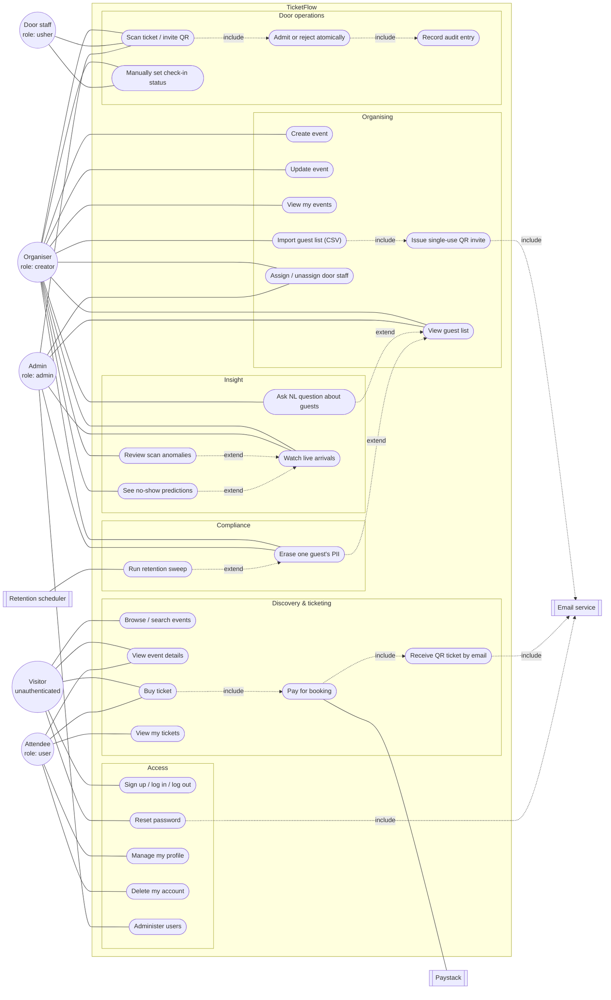

# TicketFlow — Use Case Diagram

> **Diagram set:** [Architecture](architecture-diagram.md) · [Use cases](use-case-diagram.md) · [Data flow](data-flow-diagram.md)

Actors are the four roles in `backend/src/models/userModel.js` (`user`, `creator`, `admin`,
`usher`), plus unauthenticated visitors and three external systems. Dashed arrows are
`<<include>>` / `<<extend>>` relationships; solid lines are actor associations.

---

## 1. Use case diagram

## 2. Use case ↔ implementation trace

| # | Use case | Actor(s) | Endpoint | Service |
|---|---|---|---|---|
| 1 | Browse / search events | Visitor | `GET /api/events`, `/trending`, `/upcoming`, `/count` | `eventService` |
| 2 | View event details | Visitor, Attendee | `GET /api/events/:slug` | `eventService` |
| 3 | Sign up / log in / log out | Visitor | `POST /users/signup`, `/login`, `GET /logout` | `authService` |
| 4 | Reset password | Visitor | `POST /forgot-password`, `PATCH /reset-password/:token` | `authService` |
| 5 | Buy ticket | Visitor, Attendee | `POST /api/bookings/create` (`isLoggedIn`) | `bookingService` |
| 6 | Pay for booking | Attendee → Paystack | `POST /api/bookings/webhook/paystack` | `paymentService` |
| 7 | Receive QR ticket by email | Attendee | — (side effect of 5, post-commit) | `bookingService` + `email` |
| 8 | View my tickets | Attendee | `GET /api/bookings/my-tickets` | `bookingService` |
| 9 | Manage profile | Attendee | `GET /me`, `PATCH /update-my-details`, `/update-my-password` | `userService`, `authService` |
| 10 | Delete account | Attendee | `DELETE /api/users/delete-me` | `userService` |
| 11 | Create event | Organiser | `POST /api/events/create` | `eventService` + Cloudinary |
| 12 | Update event | Owner, Admin | `PATCH /api/events/update/:eventId` | `eventService` |
| 13 | View my events | Organiser | `GET /api/events/my/events` | `eventService` |
| 14 | Import guest list | Organiser, Admin | `POST /api/events/:eventId/guests` | `guestService.importGuests` |
| 15 | Issue single-use QR invite | (system, within 14) | — | `guestService` + `generateQrCode` |
| 16 | View guest list | Organiser, Admin | `GET /api/events/:eventId/guests` | `guestService.getGuests` |
| 17 | NL guest query | Organiser, Admin | `POST /:eventId/guests/query` | `nlGuestQueryService` |
| 18 | Watch live arrivals | Organiser, Admin | `GET /:eventId/dashboard`, `GET /:eventId/stream` | `dashboardService` + `admissionBus` |
| 19 | Review scan anomalies | Organiser, Admin | `GET /:eventId/anomalies` | `anomalyReportService` → `anomalyService` |
| 20 | See no-show predictions | Organiser, Admin | — (within the dashboard) | `dashboardService.getNoShowPrediction` → `noShowService` |
| 21 | Assign / unassign door staff | Organiser, Admin | `GET/POST /:eventId/ushers`, `DELETE /:eventId/ushers/:userId` | `usherService` |
| 22 | Erase one guest's PII | Organiser, Admin | `DELETE /:eventId/guests/:guestId/erase` | `retentionService.requestErasure` |
| 23 | Scan QR at the door | Usher, Organiser, Admin | `POST /api/bookings/scan` | `admissionService.checkInByScan` |
| 24 | Admit / reject atomically | (system, within 23) | — | `bookingRepository.admitById` |
| 25 | Manually set check-in status | Usher, Organiser | `PATCH /api/bookings/check-in/:id` | `bookingService.checkInAttendee` |
| 26 | Administer users | Admin | `GET /api/users`, `GET /api/users/:id` | `userService` |
| 27 | Record audit entry | (system, within 24) | — | `auditLogRepository.record` |
| 28 | Run retention sweep | Scheduler | `npm run gdpr:sweep` | `retentionService.sweepExpiredEvents` |

## 3. Preconditions and business rules worth stating

- **Guest checkout is supported.** Use case 5 sits on `isLoggedIn`, not `protect`, so a
  Visitor can buy without an account — the booking carries a name and email rather than a
  user reference.
- **Invite-only events cannot be purchased into.** `bookingService.createBooking` rejects
  with 403 when `event.accessMode === 'invite_only'`; those events admit only from the
  organiser's guest list. `hybrid` allows both paths.
- **Seats are held before payment, and the ticket is emailed only after it.** Use case 5
  reserves inventory and writes `pending` bookings, then 6 confirms the charge, and only a
  confirmed charge triggers 7. A reservation that is never paid expires and its seats go
  back on sale, so an abandoned checkout costs nothing. Free events skip 6 entirely and are
  confirmed inline.
- **An usher's rights are event-scoped.** Role alone grants nothing: use case 21 writes
  `assignedEvents`, which `admissionService.authorizeScan` checks. An unauthorised scan of
  another event's ticket is still written to the audit log (`reason: wrong_event`).
- **Use cases 25 and 23 are different mechanisms.** 23 is the atomic single-use claim; 25 is
  the fallback for a QR that will not scan, setting `status` to `admitted` or back to
  `issued`. Both are audited, but 25's rows carry `manual: true` and are excluded from
  anomaly detection — a manual entry has no device fingerprint or scan timing, so feeding it
  to the detector would only manufacture flags.
- **Use cases 16–22 share one authorisation rule.** All call `canViewDashboard` (event owner
  or admin), enforced in the service layer so it holds regardless of the route.
